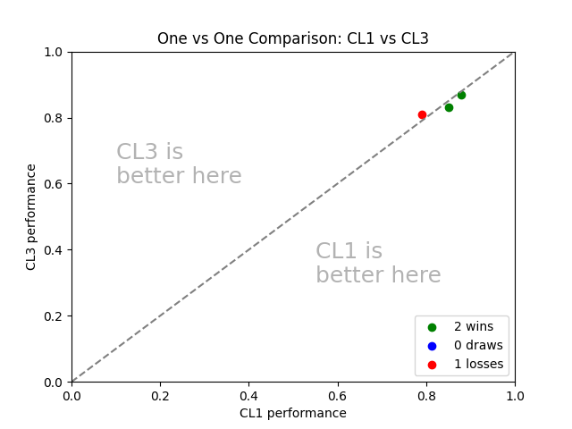
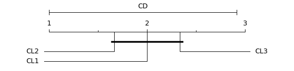

# Labicompare

## Installation

Labicompare requires at least a Python version of `3.9` or greater. Currently to install labicompare you can use the following command:

```sh
pip install git+https://github.com/jose-gilberto/labicompare/
```
Note that the package is currently on a alpha version. The commands used to install or the methods may change over time.

## Getting Started

As soon as you have the metrics for all models that you want to compare, we only need to put these values in a .csv file in the following format:

```
model_1,model_2,model_3
model_1_metric_1,model_2_metric_1,model_3_metric_1
model_1_metric_2,model_2_metric_2,model_3_metric_2
model_1_metric_3,model_2_metric_3,model_3_metric_3
```

Each column represents a model, in this case models 1, 2 and 3. Each row of the dataset represents a metric obtained on tha dataset of that row. For example, the first line may represent the metrics for dataset A obtained by the models 1, 2 and 3.

```python
import pandas as pd

metrics = pd.DataFrame({
    'CL1': [0.85, 0.88, 0.79],
    'CL2': [0.80, 0.90, 0.82],
    'CL3': [0.83, 0.87, 0.81]
}, index=['Dataset A', 'Dataset B', 'Dataset C'])
```

### Plotting 1v1 Comparison

To generate a one versus one plot comparison you only need to call the `one_vs_one_plot` function from the visualization module.

```python
from labicompare.visualization import one_vs_one_plot

one_vs_one_plot(
    metrics['CL1'].values,
    metrics['CL3'].values,
    'CL1', 'CL3'
)
```

This code will generate the following figure:



### Plotting a Critical Difference Diagram

To generate a critical difference diagram using Nemenyi test you only need to call `critical_difference_diagram` function and pass `test='nemenyi'`. Other tests such Wilcoxon-Holm or Bonferroni-Dunn are already supported.

```python
from labicompare.visualization import critical_difference_diagram

fig = critical_difference_diagram(
    metrics=metrics,
    test='nemenyi',
    alpha=0.05
)
```

This code will generate the following figure:



## How to Contribute

To contribute with this repository you only have to follow these steps:
1. Fork this repository
2. Clone your fork locally and create a branch with the name of the feature you're working on. (ex.: `feat/multi-comparison-matrix`)
3. Post on Issues/Pull Request the feature you are working on
4. Create a PR with your changes from your fork
5. Once approved your changes will be merged into this repo.

## Acknowledgements and References

References:  
[1] M. Friedman, “A comparison of alternative tests of significance for the problem of m rankings,” The Annals of Mathematical Statistics, vol. 11, no. 1, pp. 86–92, 1940.  
[2] F. Wilcoxon, “Individual comparisons by ranking methods,” Biometrics Bulletin, vol. 1, no. 6, pp. 80–83, 1945.  
[3] S. Holm, “A simple sequentially rejective multiple test procedure, ”Scandinavian Journal of Statistics, vol. 6, no. 2, pp. 65–70, 1979.  
[4] Demšar, Janez. "Statistical comparisons of classifiers over multiple data sets." The Journal of Machine learning research 7 (2006): 1-30.  
[5] Nemenyi, Peter Bjorn. Distribution-free multiple comparisons. Princeton University, 1963.  
[6] Dunn, O. J. (1961). Multiple Comparisons among Means. Journal of the American Statistical Association, 56(293), 52–64.  
[7] Ismail Fawaz, Hassan, et al. "Deep learning for time series classification: a review." Data mining and knowledge discovery 33.4 (2019): 917-963.  
[8] Ismail-Fawaz, Ali, et al. "Lite: Light inception with boosting techniques for time series classification." 2023 IEEE 10th International Conference on Data Science and Advanced Analytics (DSAA). IEEE, 2023.  
[9] Ismail-Fawaz, Ali, et al. "An approach to multiple comparison benchmark evaluations that is stable under manipulation of the comparate set." arXiv preprint arXiv:2305.11921 (2023).

## Next Steps/TODO

- [x] Nemenyi Test
- [x] Bonferroni Test
- [ ] Wilcoxon Holm Test
- [ ] One-vs-One Plot
- [ ] Parameters Plot
- [ ] Generate Latex Tables
- [ ] Statisticall Comparison (Table with Avg Ranking, Avg Metrics, ...)
- [x] Multi-Comparison-Matrix
- [ ] Refactor MCM module
- [ ] Refactor Visualization Utils
- [ ] Results Histogram