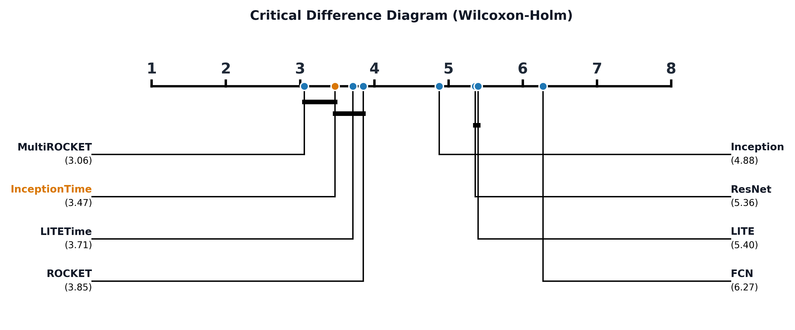

# Getting Started

**labicompare** is a Python library designed for researchers and data scientists who need to perform rigorous statistical comparisons between multiple Machine Learning models.

## Why labicompare?
When comparing models across multiple datasets, looking at mean accuracy is not enough. You need to know if the differences are statistically significant. `labicompare` automates:

- **Friedman Tests** to detect global differences.
- **Wilcoxon-Holm Post-hoc Tests** for pairwise comparisons.
- **CD Diagrams** for high-quality, publication-ready visualizations.

We also have another plots, like a `difference_distribution` plot, `pvalue_matrix` plot or `one_vs_one` plot. See the gallery or further documentation to see how you can use each one.

## Installation

Install the library using pip:

```bash
pip install git+https://github.com/jose-gilberto/labicompare/
```

**Note**: this version is already in process to be published on pip :)

## Basic Workflow

The library follows a simple three-step process:  

- **Wrap your data**: Convert your results (Accuracy, Error, etc.) into an `EvaluationData` object.
- **Test**: Run an specific test to get a statistical summary object.
- **Plot**: Generate the plots that you want.


### Example

```python
import pandas as pd
from labicompare.core.data import EvaluationData
from labicompare.stats import evaluate_models
from labicompare.plots.ranking import plot_cd_diagram

# Your results: Rows = Datasets, Columns = Models
df = pd.read_csv("results.csv")
data = EvaluationData(df, higher_is_better=True)

# Run statistics
summary = wilcoxon_holm(data, alpha=0.05)

# Visualize as an CD-Diagram
fig = plot_cd_diagram(data, summary, highlight_models=['InceptionTime'])
```

This code will produce something like this:



After that, you can manipulate the fig instance as you like. Maybe save as an PDF format for your paper :)